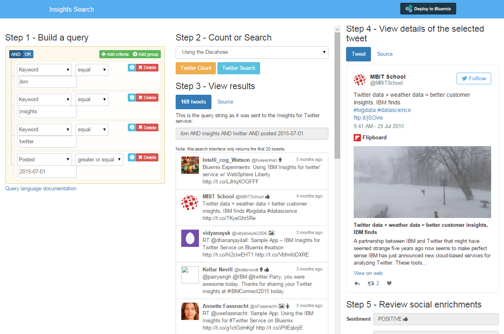

# Insights Search Overview

[](https://travis-ci.org/IBM-Bluemix/insights-search)

Insights Search provides a search interface for the IBM Insights for Twitter service.



[](https://bluemix.net/deploy?repository=https://github.com/IBM-Bluemix/insights-search.git)

## Running the app on Bluemix

1. Create a Bluemix Account

    [Sign up][bluemix_signup_url] for Bluemix, or use an existing account.
    
2. Download and install the [Cloud-foundry CLI][cloud_foundry_url] tool

3. Clone the app to your local environment from your terminal using the following command

  ```
  git clone https://github.com/IBM-Bluemix/insights-search.git
  ```

4. cd into this newly created directory

5. Edit the `manifest.yml` file and change the `<application-name>` and `<application-host>` from `insights-search` to something unique.

	```
    applications:
    - services:
      - insights-search-twitter
      name: insights-search
      host: insights-search
      path: .
      memory: 256M
	```

  The host you use will determinate your application url initially, e.g. `<application-host>.mybluemix.net`.

6. Connect to Bluemix in the command line tool and follow the prompts to log in.

	```
	$ cf api https://api.ng.bluemix.net
	$ cf login
	```
7. Create the Insights for Twitter service in Bluemix.

  ```
  $ cf create-service twitterinsights Free insights-search-twitter
  ```

8. Push the application to Bluemix.

  ```
  $ cf push
  ```

And voila! You now have your very own instance of Insights Search running on Bluemix. Navigate to the application url, e.g. `<application-host>.mybluemix.net` and start querying Twitter.

### Troubleshooting

To troubleshoot your Bluemix app the main useful source of information is the logs. To see them, run:

  ```sh
  $ cf logs <application-name> --recent
  ```

## Built with
   - [node.js](https://nodejs.org/)
   - [express](http://expressjs.com/)
   - [angularJS](https://angularjs.org) MIT
   - [angular-numeraljs](https://github.com/baumandm/angular-numeraljs) MIT
   - [angular-clipboard](https://github.com/omichelsen/angular-clipboard) MIT
   - [angular-socialshare](https://github.com/720kb/angular-socialshare) MIT
   - [angular-ui-notification](https://github.com/alexcrack/angular-ui-notification) MIT
   - [JSURL](https://github.com/Sage/jsurl) MIT
   - [livestamp.js](http://mattbradley.github.io/livestampjs/) MIT
   - [google-code-prettify](https://code.google.com/p/google-code-prettify/)
   - [Twitter Bootstrap](http://getbootstrap.com/) MIT
   - [bootstrap-datepicker](https://github.com/eternicode/bootstrap-datepicker) Apache 2.0
   - [jQuery-QueryBuilder](https://github.com/mistic100/jQuery-QueryBuilder) MIT
   - [momentjs](http://momentjs.com) MIT
   - [Twitter oEmbed](https://dev.twitter.com/web/embedded-tweets/parameters)

## Privacy Notice
This application includes code to track deployments to IBM Bluemix and other Cloud Foundry platforms.
The following information is sent to a [Deployment Tracker](https://github.com/IBM-Bluemix/cf-deployment-tracker-service)
service on each deployment:

* Application Name (application_name)
* Space ID (space_id)
* Application Version (application_version)
* Application URIs (application_uris)

This data is collected from the VCAP_APPLICATION environment variable in IBM Bluemix and other Cloud Foundry platforms. This data is used by IBM to track metrics around deployments of sample applications to IBM Bluemix. Only deployments of sample applications that include code to ping the Deployment Tracker service will be tracked.

### Disabling Deployment Tracking

Deployment tracking can be disabled by removing `require("cf-deployment-tracker-client").track();` from the beginning of the `app.js` file.

---

Insights Search is a sample application created for the purpose of demonstrating the use of the Insights for Twitter service application.
The program is provided as-is with no warranties of any kind, express or implied.

[bluemix_signup_url]: https://console.ng.bluemix.net/?cm_mmc=GitHubReadMe-_-BluemixSampleApp-_-Node-_-Workflow
[cloud_foundry_url]: https://github.com/cloudfoundry/cli

